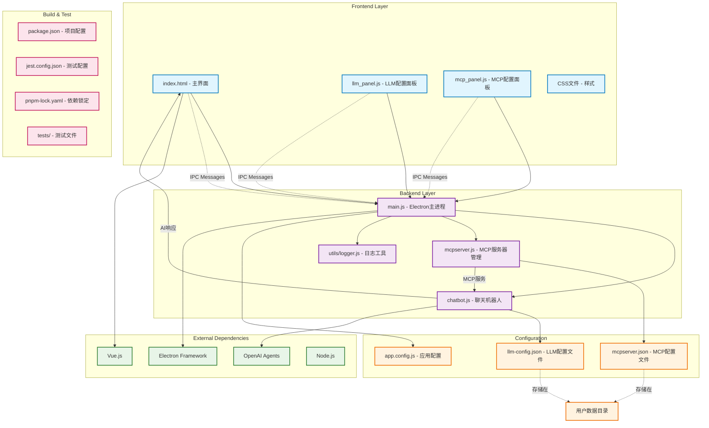

# Electron Chat App

一个基于 Electron 的智能聊天应用，支持多种 AI 模型和 MCP (Model Context Protocol) 服务器。

## 🚀 功能特性

- 🤖 **多AI模型支持**: 支持OpenAI、Anthropic、Google Gemini等多种AI模型
- 🔌 **MCP服务器集成**: 支持Model Context Protocol服务器，扩展AI能力
- 💬 **实时聊天界面**: 现代化的聊天UI，支持Markdown渲染
- ⚙️ **灵活配置管理**: 可视化配置面板，支持模型和MCP服务器配置
- 🎨 **主题切换**: 支持明暗主题切换
- 📱 **桌面应用**: 基于Electron的原生桌面应用体验
- 🔒 **安全存储**: 配置文件安全存储在用户数据目录
- 🔍 **开发工具**: 内置调试支持和开发者工具

## 📁 项目结构

```
electron-app/
├── backend/                 # 后端代码
│   ├── main.js             # Electron主进程
│   ├── chatbot.js          # 聊天机器人核心逻辑
│   ├── mcpserver.js        # MCP服务器管理
│   ├── icon.ico            # 应用图标
│   └── utils/              # 工具函数
│       └── logger.js       # 日志记录工具
├── frontend/               # 前端代码
│   ├── index.html          # 主界面
│   ├── index.css           # 主样式
│   ├── llm_panel.js        # LLM配置面板
│   ├── llm_panel.css       # LLM面板样式
│   ├── mcp_panel.js        # MCP配置面板
│   └── mcp_panel.css       # MCP面板样式
├── config/                 # 配置文件
│   └── app.config.js       # 应用配置
├── tests/                  # 测试文件
│   └── setup.js            # 测试设置
├── package.json            # 项目配置
├── jest.config.json        # 测试配置
├── pnpm-lock.yaml          # 依赖锁定
└── pnpm-workspace.yaml     # 工作区配置
```

## 🏗️ 架构图



### 🏛️ 架构说明

#### Frontend Layer（前端层）
- **index.html**: 主界面，提供聊天功能和用户交互
- **llm_panel.js**: LLM模型配置面板，使用Vue.js构建，支持模型选择和API配置
- **mcp_panel.js**: MCP服务器配置面板，管理MCP服务器连接和配置
- **CSS文件**: 界面样式定义，支持主题切换

#### Backend Layer（后端层）
- **main.js**: Electron主进程，负责窗口管理、IPC通信和应用生命周期
- **chatbot.js**: 聊天机器人核心逻辑，集成OpenAI Agents，处理AI对话
- **mcpserver.js**: MCP服务器管理功能，支持多MCP服务器连接
- **logger.js**: 日志记录工具，提供结构化日志输出

#### Configuration（配置层）
- **app.config.js**: 应用程序基础配置
- **llm-config.json**: LLM模型配置文件（存储在用户数据目录）
- **mcpserver.json**: MCP服务器配置文件（存储在用户数据目录）

#### 技术特点
1. **跨进程通信**: 使用Electron的IPC机制实现前后端通信
2. **模块化设计**: 前端使用Vue.js组件化，后端采用ES模块
3. **配置管理**: 配置文件存储在用户数据目录，支持持久化
4. **AI集成**: 集成OpenAI Agents框架和MCP服务器协议
5. **开发工具**: 使用PNPM包管理，Jest测试框架，ESLint代码检查

## 🛠️ 开发环境设置

### 前置要求

- Node.js >= 18.0.0
- npm 或 pnpm

### 安装依赖

```bash
npm install
```

### 运行开发环境

```bash
npm run dev
```

### 构建应用

```bash
# Windows
npm run build:win

# macOS
npm run build:mac

# Linux
npm run build:linux
```

## 🧪 测试

```bash
# 运行测试
npm test

# 监听模式
npm run test:watch

# 代码检查
npm run lint
```

## 📖 使用说明

### 基本使用

1. **启动应用**
   ```bash
   npm start
   ```

2. **配置AI模型**
   - 点击顶部的"🧠 模型"按钮
   - 设置API Base URL和API Key
   - 选择要使用的模型
   - 点击"测试连接"验证配置

3. **配置MCP服务器（可选）**
   - 点击顶部的"🔧 MCP"按钮
   - 添加MCP服务器配置
   - 启用需要的服务器

4. **开始聊天**
   - 在底部输入框输入消息
   - 按Enter发送或点击发送按钮
   - AI将使用配置的模型和MCP服务器响应

### 高级功能

- **主题切换**: 点击"🌙 暗黑"按钮切换明暗主题
- **清空聊天**: 点击"清空聊天"按钮清除所有对话历史
- **调试模式**: 使用`npm run debug`启动调试模式

## 🔧 配置

应用配置文件位于用户数据目录：
- Windows: `%APPDATA%/electron-app/`
- macOS: `~/Library/Application Support/electron-app/`
- Linux: `~/.config/electron-app/`

## 🤝 贡献

欢迎提交 Issue 和 Pull Request！

## 📄 许可证

MIT License
